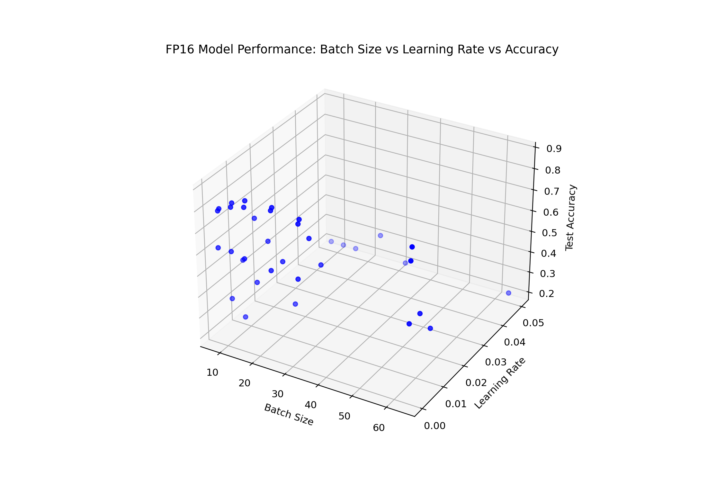

# VENµS Multispectral Maritime Vessel Classification using AI

## Description
This GitHub repository is dedicated to an AI-based classification project using the VENµS Multispectral Maritime Vessel Classification Dataset. The dataset, derived from the VENµS satellite's VSSC instrument, features high-resolution, multispectral optical images of Earth's surface, focusing on maritime environments. The project's primary goal is to develop and validate deep learning models that can classify maritime vessels directly onboard satellites using raw multispectral data.

## Models and Performance
- **EfficientNet B0 Lite Model:** Customized for this dataset, focusing on efficiency and accuracy.
- **MobileViT Model:** Incorporates Vision Transformers with MobileNet, optimized for the dataset.
- **Performance:** Both models achieve a test accuracy exceeding 85%, demonstrating their effectiveness in vessel classification tasks with AMP (FP16).

## Data Characteristics
- **Type:** Raw multispectral imagery with 12 spectral bands, coregistrated using PyRaws software.
- **Annotations:** COCO format, supplemented with AIS data.
- **Categories:** Includes various vessel types such as Cargo, Tanker, Fishing, Passenger.

## Use Case
The project aims to advance maritime surveillance and traffic monitoring using state-of-the-art AI in remote sensing. The dataset and models are pivotal for environmental studies and maritime activities monitoring.

## Additional Information
- **Documentation:** Refer to [10.1109/IGARSS.2010.5652087] for sensor specifications.
- **Note:** This repository focuses on the AI classification models developed using the dataset rather than the dataset itself.

## Contributing
We welcome contributions from the remote sensing and AI community to further enhance the models and explore new applications.
